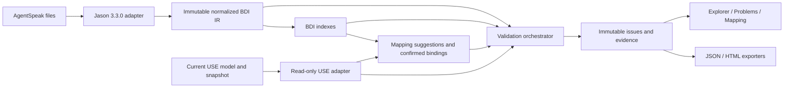

# System Architecture

Status: canonical implemented architecture
Verification: source-backed; see Git history and DocumentationContractTest

## 1. Architecture summary

The extension is an in-repository Maven module loaded by the USE desktop
plugin runtime. It is a local modular monolith: there is one Swing process, no
server, no database, and no network dependency for import or validation.



## 2. Architectural goals

- Extend USE without introducing a second AgentSpeak parser.
- Keep Jason and USE concrete classes behind adapters.
- Keep domain, mapping, validation, and report data immutable and testable.
- Make unsupported/unknown results observable.
- Preserve the current USE state during every analysis.
- Package a self-contained plugin runtime while reusing USE host classes.
- Reproduce the thesis evidence without live external services.

## 3. Runtime components

| Component | Concrete boundary | Responsibility |
| --- | --- | --- |
| USE host | `use-core`, `use-gui` | UML/OCL compiler, model, system state, GUI, plugin loader |
| Plugin descriptor | `src/main/resources/useplugin.xml` | Registers plugin metadata and two actions |
| Integration actions | `BdiPlugin`, `HelloBdiAction`, `ImportBdiAction` | Lifecycle probe, file chooser, current session, view creation |
| Import application service | `BdiImportService`, `BdiImportWorker` | Per-file import, materialization, indexing, background execution |
| Jason adapter | `JasonAslParserAdapter`, `JasonAstToIrNormalizer` | Parse and translate Jason AST into plugin-owned values |
| Domain model | `model/ir`, `index` | Immutable BDI nodes, source spans, unsupported features, indexes |
| USE adapter | `UseUmlModelFacade`, `UseSnapshotOclEvaluator` | Immutable projection, OCL evaluation, bounded state variation |
| Mapping | `model/mapping`, `persistence` | Suggestions, bindings, fingerprints, stale detection, JSON |
| Validation | `validation`, `rules` | Configuration, orchestration, 22 rules, issues, suppressions |
| Presentation | `ui`, `problems` | Explorer, detail, Problems, Mapping tabs |
| Reporting | `report` | Deterministic JSON and escaped HTML serialization |

## 4. Layer and dependency rules

```text
Swing actions/views
       |
Application services
       |
Domain IR + indexes + mappings + validation records
       ^                         ^
Jason adapter                USE adapter
```

- `model/ir`, `index`, mapping domain values, and validation records do not
  import Swing, Jason AST, or USE concrete classes.
- Jason classes stop at parser/normalizer code.
- USE classes stop at plugin action and `use/` adapters.
- Rule implementations consume `ValidationContext`, not current Swing state.
- Persistence codecs serialize domain values and do not perform validation.
- Exporters serialize supplied data and do not execute analysis.

## 5. Main runtime flow

1. USE discovers the shaded plugin JAR under `lib/plugins` and reads
   `useplugin.xml`.
2. The user opens `Plugins > AgentSpeak > Import AgentSpeak...` and selects
   one or more `.asl` files.
3. `ImportBdiAction` creates a `BdiExplorerView`. If a USE system exists, the
   view receives an immutable model/snapshot projection and OCL evaluator.
4. `BdiImportWorker` runs `BdiImportService` outside the Swing event thread.
5. Each source is parsed independently; successful models are normalized and
   indexed while diagnostics from failures are retained.
6. The view creates mapping candidates against the captured USE projection.
7. `ValidationOrchestrator` evaluates enabled rules and updates Problems.
8. Confirming/changing a mapping re-runs validation.
9. Save/load actions persist the mapping document selected by the user.
10. Case-study/test pipelines may construct `ReportData` and invoke JSON/HTML
    exporters.

## 6. Threading and lifecycle

- Swing UI changes occur on the event-dispatch thread.
- AgentSpeak import uses `SwingWorker`.
- Starting a newer import cancels the old worker and increments a generation
  token; callbacks from stale generations are ignored.
- `detachModel()` cancels active work and invalidates callbacks.
- The view captures the USE projection at construction/import workflow time;
  there is no continuous host-model change subscription.
- Plugin replacement requires a USE restart; hot reload is not implemented.

## 7. State ownership

| State | Owner | Mutability policy |
| --- | --- | --- |
| UML model and system snapshot | USE host | Read-only to normal plugin analysis |
| Parsed AgentSpeak AST | Jason adapter scope | Not exposed as domain state |
| Normalized IR/index | Import snapshot | Immutable replacement per import |
| Mapping document | Mapping editor/domain | Immutable value replaced on edit/load |
| Rule configuration | Application caller | Immutable, default is all standard rules |
| Suppressions | Application/report caller | Immutable list applied after evaluation |
| Problems/issues | Validation result | Immutable values projected into table model |
| Reports | Output path | New UTF-8 files; not authoritative state |

## 8. OCL and bounded mutation boundary

Read-only expressions use copied `VarBindings`. A `soil:` effect uses
`MSystem.beginVariation()` and `endVariation()` with restoration in `finally`.
The plugin evaluates the requested effect and invariants inside that disposable
variation. Compile, bind, execution, and invariant-check failures remain
evidence-bearing `UNKNOWN`/failure results.

Full behavioral verification, plan execution, and unbounded state exploration
are outside this architecture.

## 9. Packaging and dependency model

The root reactor contains `use-core`, `use-gui`, `use-bdi-plugin`, and
`use-assembly`. USE dependencies are `provided`; Jason 3.3.0 and its runtime
dependencies are shaded into `use-bdi-plugin-7.1.1.jar`. The assembly copies
that JAR into `use-7.1.1/lib/plugins/`.

The plugin uses the host classloader for USE APIs. The descriptor has no
dependency declaration mechanism, so the runtime JAR must contain Jason. Signed
metadata and module descriptors are excluded during shading; third-party
notices remain embedded.

## 10. Failure model

| Failure | Required behavior |
| --- | --- |
| One invalid source in a multi-file import | Retain diagnostic and continue other files |
| Unsupported normalized construct | Retain explicit unsupported node/evidence |
| No active USE system | Import/UI work; model-dependent analysis degrades safely |
| Stale import callback | Ignore it |
| Missing mapping target | Emit stale mapping evidence; do not auto-rewrite binding |
| Unknown configured rule | Reject configuration before evaluation |
| OCL compile/evaluation failure | Return non-PASS status and evidence |
| Bounded effect failure | Restore state and report result |
| Malformed persisted JSON | Reject load; keep current in-memory document |
| Malformed/unknown-rule project configuration | Reject before opening Explorer and show the configuration error |
| Report write failure | Surface I/O failure and leave analysis state unchanged |

## 11. Architecture limitations

- The current view does not subscribe to later USE snapshot/model changes.
- Source IDs and source fingerprints include normalized absolute paths.
- `ReportMain` is a serializer smoke/demo, not a live GUI-analysis exporter.
- Mapping semantics are conservative and do not prove model equivalence.

Detailed implementation history remains in [the specialized architecture
notes](04_SYSTEM_ARCHITECTURE.md), [plugin technical
design](10_PLUGIN_TECHNICAL_DESIGN.md), and [decision log](DECISION_LOG.md).

## 12. Architecture synchronization checklist

- [x] Component names match current packages/classes.
- [x] Runtime and thread boundaries match current action/view code.
- [x] Persistence and live-GUI limitations are explicit.
- [x] Packaging matches current Maven scopes and shade configuration.
- [x] State safety matches accepted OCL decisions and tests.
