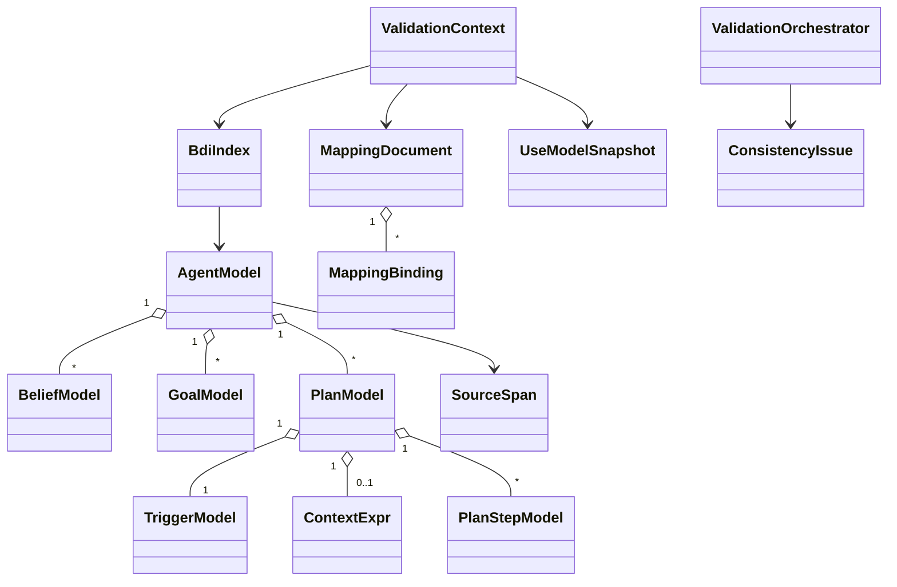
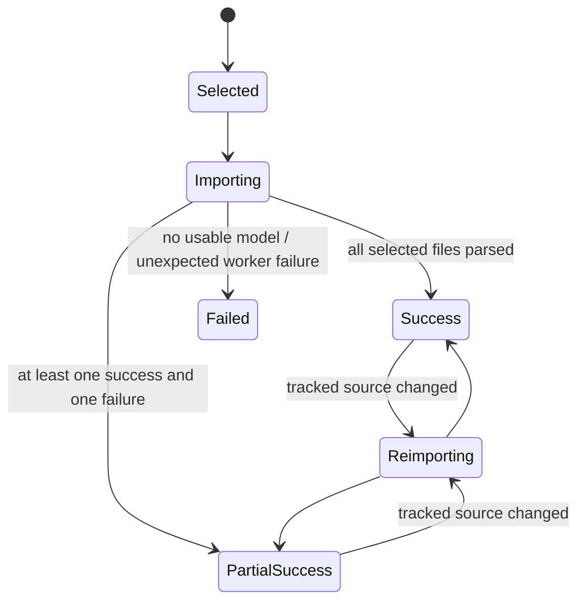
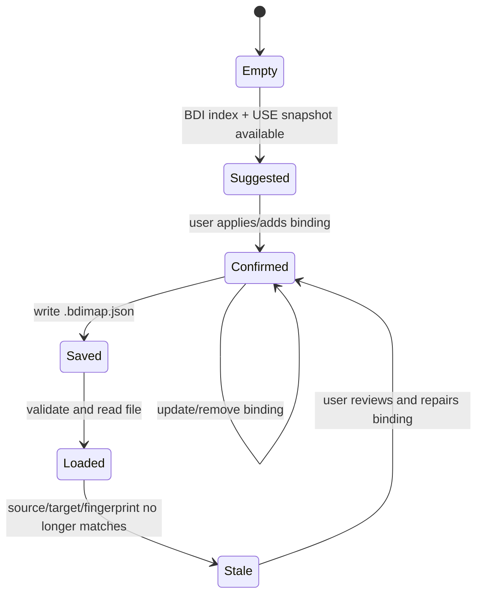
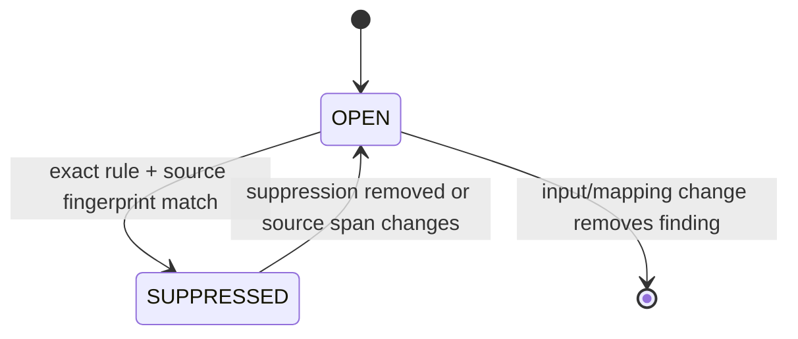

# Domain and Flows

Status: canonical domain and workflow specification
Last verified: 2026-08-09
Code baseline: `c1b11b41`

## 1. Domain model

## 2. Core entities

| Entity | Responsibility and invariant |
| --- | --- |
| `AgentModel` | One normalized source root with beliefs, goals, plans, unsupported features, and parser/metamodel metadata |
| `SourceSpan` | Normalized source path plus one-based begin/end positions; unknown positions are explicit |
| `PlanModel` | Label, trigger, optional context, ordered body, and source span |
| `ContextExpr` | Supported literal/unary/binary context tree or explicit unsupported context |
| `PlanStepModel` | Typed action, internal action, achieve goal, belief update, test, constraint, or unsupported step |
| `TermModel` | Typed literal/compound/list/set/string/number/variable/arithmetic or unsupported term |
| `BdiIndex` | Immutable derived lookup for goals, calls, predicates, references, and duplicate labels |
| `UseModelSnapshot` | Immutable projection of UML structure, constraints, objects, links, values, and fingerprint |
| `MappingDocument` | Schema/metamodel/model identity plus unique bindings keyed by kind and source |
| `MappingSuggestion` | Ranked candidate with score/evidence; never automatically confirmed |
| `ConsistencyIssue` | Rule outcome with status, certainty, location, UML reference, evidence, and suggested fix |
| `Suppression` | Rule ID plus source fingerprint and mandatory reason |
| `ReportData` | Immutable serialization input and optional model/mapping hashes |

## 3. Identity rules

- Agent identity is derived from normalized source/model data, not a Jason AST
  object identity.
- Mapping replacement identity is `MappingKind + source`.
- UML targets use stable qualified references from `UseUmlModelFacade`.
- Issue suppression identity is `ruleId + SHA-256(source path and span)`.
- Model identity is a SHA-256 hash of a canonical sorted USE projection.
- Mapping identity is a SHA-256 hash of canonical sorted mapping content.
- Current source paths are normalized absolute paths. Moving a checkout can
  invalidate mappings/suppressions and changes report locations.

## 4. Import lifecycle

Per-file parse failures are values in the import report, not exceptions that
abort unrelated files. An unexpected application/worker failure updates the UI
failure status. A stale worker completion cannot replace a newer generation.

## 5. AgentSpeak import flow

1. Normalize and preserve selected file order.
2. Parse each file with Jason 3.3.0 and web mind inspector disabled.
3. On syntax failure, emit `ASL-001` with parser token location when available.
4. On file/import failure without parser position, emit `ASL-IMPORT-001`.
5. Normalize successful Jason ASTs into plugin-owned immutable IR.
6. Convert representational gaps into unsupported nodes/features and `ASL-002`.
7. Materialize successful models and build one combined `BdiIndex`.
8. Return successful models and all diagnostics in one immutable snapshot.

## 6. Mapping lifecycle

Suggestions use normalized names, operation arity/signature, and evidence.
Confirmation is explicit. Loading malformed or unsupported-version JSON fails
without partially replacing the active document.

## 7. Validation flow

1. Build `ValidationContext` from import snapshot, mapping document, optional
   USE projection, and optional snapshot OCL evaluator.
2. Validate rule configuration against the supplied rule catalog.
3. Execute enabled rules in stable phase/rule order.
4. Normalize each finding into an immutable `ConsistencyIssue`.
5. Apply matching suppressions after rule evaluation when the caller supplied
   a `SuppressionService`.
6. Project issues into Problems or pass them to an exporter.

The default GUI constructs `ValidationOrchestrator()` with all standard rules
and no project-file auto-loading. Persistence support exists but is not an
implicit GUI lifecycle.

## 8. Issue lifecycle

The MVP does not persist a resolved/closed issue database. Re-evaluation
recomputes issues from immutable inputs. Suppression is transparent and remains
included in reports.

## 9. OCL snapshot flow

1. Resolve a confirmed action-operation mapping.
2. Resolve receiver object and operation parameters.
3. Bind values in copied USE variable bindings.
4. Compile/evaluate preconditions on the current snapshot.
5. Return PASS when all required expressions are true, FAIL when a confirmed
   expression is false, and UNKNOWN for unavailable/compile/evaluation gaps.
6. If an explicit `soil:` effect exists, begin a disposable variation, execute
   the effect, check invariants, and always restore the variation.

No general AgentSpeak plan execution occurs.

## 10. GUI workflow

1. Load a `.use` specification in USE when model-aware analysis is desired.
2. Open `Plugins > AgentSpeak > Import AgentSpeak...`.
3. Select one or more `.asl` files.
4. Inspect normalized nodes and source excerpts in Explorer.
5. Review diagnostics/findings in Problems.
6. Review suggestions and confirm/save/load bindings in Mapping.
7. Re-import after tracked source content changes.
8. Use the case-study scripts for reproducible report/evaluation output.

The exact presentation clicks are maintained in [the user guide](USER_GUIDE.md).

## 11. Case-study flow

The Auction pipeline compiles `Auction.use`, imports `auctioneer.asl` and
`bidder.asl`, creates a populated USE snapshot, confirms 14 mappings, evaluates
the baseline, exports deterministic JSON/HTML, and applies four independent
mutant families. Ground truth and metric calculations are fixture-scoped.

## 12. Domain invariants

- Domain collections are immutable copies.
- Mapping keys and suppression keys are unique.
- Schema and metamodel versions are non-empty and supported.
- SHA-256 identities contain 64 hexadecimal characters.
- Rule IDs use the documented uppercase identifier form.
- Suppression reasons are non-empty.
- Issue counts and mapping counts are non-negative.
- Unknown information is represented explicitly.
- Analysis never treats a suggestion as confirmation.

## 13. Flow synchronization checklist

- [x] Import, mapping, validation, OCL, GUI, and case-study flows match code.
- [x] State transitions do not imply persisted issue workflow or live reload.
- [x] Failure/partial-success behavior is explicit.
- [x] Identity portability limitation is explicit.
- [x] Every flow has corresponding traceability entries.
