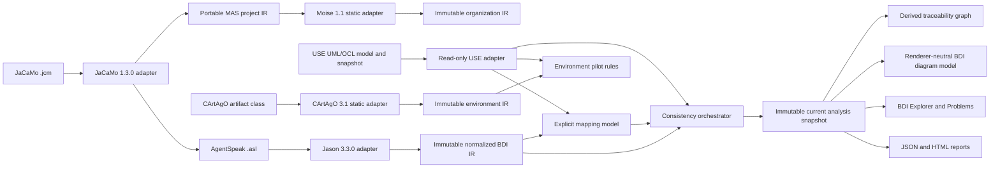

# System Architecture

Status: canonical architecture and safety boundary
Verification: source-backed; see Git history and DocumentationContractTest

## 1. Research Architecture



The plugin is a bridge between two authorities. Jason owns AgentSpeak syntax;
USE owns UML/OCL and snapshot semantics. Plugin-owned values connect them.

## 2. Layers And Dependency Rules

| Layer | Packages/components | May depend on |
| --- | --- | --- |
| Integration/UI | plugin actions, `ui` | application services and USE GUI boundary |
| Application | `application`, report composition | importer, index, mapping, validation abstractions |
| Adapters | `importer`, `use` | Jason/JaCaMo/CArtAgO/Moise or USE concrete APIs, respectively |
| Domain | `model.ir`, `model.mas`, `model.organization`, `model.mapping`, `diagram`, issue values | Java/plugin-owned values only |
| Analysis | `index`, `validation` | normalized IR, mappings, immutable USE projection |
| Persistence | `persistence`, report exporters | versioned plugin-owned DTOs |

Hard rules:

- Jason AST and exceptions stop in the importer/normalizer boundary.
- JaCaMo project/parser types stop in `JaCaMoProjectParserAdapter`.
- CArtAgO artifact/annotation types stop in `CArtAgOArtifactAdapter`.
- Moise parser/model types stop in `MoiseOrganizationParserAdapter`.
- Swing and USE concrete classes never enter normalized IR.
- Rule evaluation consumes normalized IR and immutable projections, not parser
  AST or mutable GUI state.
- Unsupported syntax creates explicit diagnostics/features; it is never
  silently discarded.
- USE core changes require a dedicated ADR. Plugin-first is the default.

## 3. Runtime Flow

1. The user opens a `.use` model in USE.
2. `ImportBdiAction` reads the current `Session`/`MSystem`.
3. `BdiProjectConfigurationLoader` discovers optional rule and suppression
   files beside the active model.
4. A background worker parses all selected `.asl` files independently.
5. The Jason adapter normalizes successful ASTs and retains failures as
   diagnostics.
6. `BdiIndexBuilder` derives signatures, references, support, and call sites.
7. `UseUmlModelFacade` creates a deterministic read-only UML/snapshot view.
8. Suggestions remain candidates until the user confirms mapping bindings.
9. `ValidationOrchestrator` runs enabled rules by phase and applies exact
   suppressions.
10. `CurrentAnalysisSnapshotService` validates once and freezes import, USE,
    mapping, config, suppressions, issues, hashes, counts, time, and versions.
11. Explorer/Problems consumes that snapshot; `CurrentAnalysisReportService`
    serializes the same object atomically as JSON or HTML without querying
    Swing, rerunning validation, or reading live USE state.
12. `HeadlessAnalysisService` compiles an isolated USE system from explicit
    files and composes the same snapshot/report services without Swing or a
    live USE session. It verifies its private state fingerprint before/after.
13. `ImportJaCaMoAction` and the Explorer `.jcm` button create the same
    immutable project request. `BdiProjectImportWorker` runs composition off
    the EDT and publishes only the current generation on the EDT.
14. `BdiQualityGateMain --jcm` validates the explicit project input, delegates
   to `MasProjectAnalysisService`, writes the existing JSON/HTML serializers,
   and prints sorted project diagnostics with the documented exit code.
15. `BdiDiagramBuilder` reads the exact frozen snapshot plus an explicit project
    root and projects BDI structure, index-derived goal support, confirmed UML
    mappings, and explicit gaps without parsing or validating again.

Asynchronous imports carry a generation token so an older completion cannot
replace a newer selection. Manual USE refresh resolves the current session
system again, captures and validates on the EDT, rejects stale queued requests,
and verifies the state fingerprint before and after analysis.

## 4. State Ownership And Safety

| State | Owner | Policy |
| --- | --- | --- |
| Jason AST | importer invocation | transient, never exposed |
| BDI IR/index | import snapshot | immutable |
| USE projection | adapter snapshot | immutable/read-only |
| Mappings/config/suppressions | plugin/user files | versioned and validated |
| Current analysis/Problems | application snapshot service | immutable, recomputed |
| Traceability graph | trace builder | immutable, derived per snapshot, never persisted |
| Diagram model | `diagram` package/caller | immutable, portable, renderer-neutral, validated before publication, never persisted |
| Reports | GUI or headless caller | atomic serialization of supplied evidence only |

OCL results are `PASS`, `FAIL`, or `UNKNOWN`; compile/evaluation errors cannot
be converted to success. Bounded `soil:` effects execute only inside a USE
variation, and cleanup occurs in `finally`. Tests compare fingerprints before
and after analysis.

## 5. Persistence And Project Context

There is no database, server, tenant, account, or network API. Optional files:

```text
<model-directory>/
  Model.use
  .bdimap.json
  .bdi-plugin/
    rules.json
    suppressions.json
```

The active `.use` parent is the project root. Missing config files use visible
defaults; malformed versions or unknown rule IDs abort Explorer creation with
an error. `ProjectSourceId` v2 provides a case-preserving relative path and
  source range under an explicit root and rejects outside-root sources. Schema
  v2 repositories migrate v1 mappings on save and retain v1 suppression hashes
  as explicitly legacy-only entries.

## 6. Packaging And Host Lifecycle

`use-bdi-plugin` is an in-repository Maven module. USE dependencies are
`provided`; Jason 3.3.0 and required runtime dependencies are shaded without
package relocation. The assembly places the plugin JAR under `lib/plugins`.

Actions implement `IPluginActionDelegate`, access the current session through
`IPluginAction`, and add `ViewFrame` through `MainWindow.addNewViewFrame(...)`.
Replacing the JAR requires restarting USE.

## 7. Current JaCaMo Boundary

`JaCaMoProjectParserAdapter` uses the official JaCaMo 1.3.0 parser and converts
its result immediately to plugin-owned values. `MasProjectImportService`
resolves sources under an explicit project root, delegates each unique source
to `BdiImportService`, and returns portable `MasProjectModel` plus the existing
AgentSpeak snapshot. Duplicate, missing, invalid, and outside-root sources are
diagnostic outcomes rather than silent omissions.

Workspace and institution declarations remain `MasResourceReference` values
with `UNSUPPORTED` status and `JCM-005`. A referenced organization file is
passed to the official Moise 1.1 `OS.loadOSFromURI` API and normalized by
`MoiseOrganizationParserAdapter` into immutable, portable
`OrganizationModel` values. Missing, invalid, duplicate, and out-of-scope
features use `JCM-007..010`; unavailable element coordinates remain explicit
unknown source spans. ADR-0034 supersedes the earlier ADR-0032 blocker.
`MasProjectAnalysisService` composes the importer result with the existing
`CurrentAnalysisSnapshotService`. It accepts immutable project/USE/mapping/
configuration inputs, runs the shared validator once, and returns one
`MasProjectAnalysisResult` containing the project IR, snapshot, and sorted
project diagnostics. Direct `.asl` analysis remains compatible because both
paths consume the same `BdiImportSnapshot` and snapshot boundary.
`ImportJaCaMoAction` registers the single-select `.jcm` chooser under
`Plugins > AgentSpeak`; `BdiExplorerView` exposes the same action as
`Import .jcm...`. Project analysis is asynchronous, project diagnostics are
shown in the Explorer tree/status, and export uses the snapshot already held
by the view. `BdiQualityGateMain --jcm` is the non-Swing equivalent and rejects
mixed `.asl`/`.jcm` inputs before writing reports.

The snapshot's version evidence distinguishes the Java BDI IR/index contract
from the broader specification-only JaCaMo Analysis Profile. The stable
`AnalysisMetamodelDescriptor` is copied unchanged through direct `.asl` and
`.jcm` composition into GUI/headless JSON/HTML exports. Report, trace, and
diagram consumers read the frozen snapshot only and never trigger validation
or a live USE read.

Separately, `CArtAgOArtifactAdapter` can normalize a supplied artifact class's
official `@OPERATION` metadata and explicit property descriptors. The plugin
does not start a JaCaMo/CArtAgO runtime, model runtime Moise semantics, dynamically
inspect CArtAgO artifacts, or consume execution traces. The GUI/headless
entry points provide static `.jcm` composition only; they do not launch a
JaCaMo runtime.

The `diagram` package is a presentation-domain boundary, not a renderer or a
second analysis model. Its records contain only plugin-owned immutable values,
portable `ProjectSourceId` v2 evidence, qualified semantic selection
references, and issue enums. Length-framed node, edge, and group identities are
deterministic; constructors reject duplicate identities, unknown endpoints,
and checkout-absolute selection references. `BdiDiagramBuilder` now projects
the exact current snapshot into this contract. `TraceabilityDiagramContributor`
projects the existing immutable `TraceabilityGraph` into the same model for
source-to-mapping-to-UML/OCL-to-issue evidence. It does not invoke validation,
OCL evaluation, or snapshot creation; it maps existing trace relations,
preserves issue metadata, keeps explicit gap nodes, deduplicates equivalent
visual edges, and replaces non-portable labels. `BdiDiagramPanel` is a
read-only Swing presentation boundary over the combined immutable model. Its
custom Java2D canvas provides deterministic type-column layout, bounded zoom,
shift/middle-button pan, fit/reset, selection, and tooltips. Layout computation
runs in a `SwingWorker`; the canvas never edits the model or reruns analysis.
T21 adds `DiagramViewMode` and a renderer-side `DiagramModeProjector` for the
BDI Plan, Agent Overview, and confirmed Mapping views. A mode filters the
already-built immutable model, preserves `EXECUTES` step-order attributes,
keeps explicit mapping gaps, and retains a selected node when it remains
visible; it never reparses, revalidates, evaluates OCL, or mutates USE state.
T22 adds presentation-only visual states for confirmed/potential/unknown
issues, missing/stale mappings, and selection. `DiagramHighlightPath` follows
the existing evidence edges from a selected rule ID, while the Problems table
can select that rule and focus the Diagram tab; node details show source,
status, mapping attributes, and evidence. Refreshing a derived diagram
reprojects the same immutable snapshot and reapplies or clears the active
highlight without reparsing. The canvas never treats UNKNOWN as PASS.
Navigation beyond this issue-to-evidence path, export, and extensions beyond
these modes remain planned separate slices and must consume these records
without reparsing.

T23 adds `MasOverviewDiagramBuilder` for the `.jcm` path. `BdiExplorerView`
combines its immutable projection with the BDI and traceability projections,
so the canvas can show the MAS project, every agent instance and source file,
normalized organization roles/missions, visible project resources, and
optional normalized CArtAgO artifacts/operations. Confirmed organization and
environment mappings become UML/OCL target nodes; missing sources or operations
become explicit `GAP` nodes rather than disappearing. The builder accepts
`MasProjectModel`, `OrganizationModel`, `EnvironmentModel`, and the existing
`CurrentAnalysisSnapshot`; it does not parse, validate, launch JaCaMo, enact
Moise, inspect live CArtAgO state, or mutate USE state. Layer attributes and a
static-only legend distinguish BDI, organization, environment, UML/OCL, and
issue/evidence content. Shared source nodes are de-duplicated in the group
without changing their stable identity.

T24 keeps live-presentation navigation inside the Swing presentation boundary.
`DiagramNavigationProjector` receives the already selected `DiagramViewMode`
projection, a set of hidden presentation layers, and an optional stable focus
node ID. Layer filtering and bounded focus rebuild only immutable diagram
values; the original `sourceModel` remains available for Reset and refresh.
Focus retains the selected agent/goal/plan, its direct predecessors and
successors, and bounded existing evidence paths to issue nodes. It does not
discover new semantics or run rules. `BdiDiagramPanel` exposes Fit, Reset,
Zoom, Focus Agent, Focus Goal/Plan, and Issues/UML-OCL/Organization/Environment
toggles. Reset restores `ALL`, every layer, and the full source graph. Controls
whose layer is absent are disabled, so direct `.asl` imports do not imply
JaCaMo structures. Cross-tab mapping/source navigation beyond the existing
selection detail and Problems-to-Diagram path remains separate work.

T25 protects the presentation boundary with source-backed canonical demo
integration tests. Family Person and Smart Queue use direct AgentSpeak
projection; Smart Home and Auction also use the normalized static `.jcm` MAS
overview. Their portable mapping files feed only confirmed bindings into the
existing snapshot. Smart Home's workspace and Auction's workspace,
institution, organization, action, and message are static source concepts, not
runtime claims. The tests compile the canonical USE specifications where OCL
evidence is required and build the existing BDI, MAS, and trace projections;
they introduce no demo-specific parser or diagram model.

T26 validates issue highlighting against the reviewed Auction evaluation
manifest. `DiagramHighlightPath` starts at issue nodes and follows only
incoming evidence edges toward their source; it does not traverse forward from
a shared source or mapping into sibling issue branches. The generic traversal
has no rule or mutant switch. Tests run the real headless snapshot/OCL pipeline
for the scoped baseline plus `MAP-003`, `SIG-001`, `REF-001`, and `OCL-001`
cases, then project the existing trace graph. Baseline cleanliness remains
bounded by the manifest's evidence tokens and does not erase known out-of-scope
reference findings.

T27 adds presentation-only SVG export under ADR-0043. `DiagramSvgExporter` receives
the panel's current immutable mode/layer/focus projection plus selected and
highlighted IDs, recomputes the same deterministic `BdiDiagramLayout`, and
writes no semantic graph format. Shared `DiagramPalette` values keep Swing and
SVG status colors aligned. UTF-8/XML escaping and non-portable label removal
happen before an atomic file move; an existing file requires explicit UI
confirmation. Export errors update presentation status only and cannot replace
the current analysis or source model.

T28 closes the visualization regression boundary with
`VisualizationBoundaryContractTest`. Diagram projection and rendering sources
cannot invoke parser, validator, OCL evaluator, or USE runtime implementations,
while validation cannot depend back on diagram or Swing presentation packages.
Immutable issue status/certainty values remain valid presentation input. This makes the no-second-
parser/no-second-validator claim executable without changing any rule catalog
or runtime behavior. Existing semantic, state-fingerprint, deterministic-report,
canonical-demo, package, and reactor tests remain the behavioral gates.

Static environment bindings are persisted separately from `.bdimap.json` in a
typed `.cartago-map.json` document. `EnvironmentMappingFileRepository` requires
an explicit project root, uses portable `ProjectSourceId` v2 provenance, emits
deterministic UTF-8 JSON, and rejects unknown fields, unsupported versions,
duplicate mapping identities, invalid roots, and malformed records. The
`EnvironmentMappingValidationService` revalidates confirmed operation/property
targets against the current plugin-owned environment and USE snapshots. Only
`CONFIRMED + CURRENT` mappings reach `EnvironmentConsistencyValidator`; a
candidate is excluded, while a stale or unknown confirmed mapping emits
`ENV-004` with source and target evidence.

The static organization pilot consumes only `OrganizationModel`, explicit
plugin-owned organization mappings, and `UseModelSnapshot`. `ORG-001` checks a
confirmed role/class target, `ORG-002` checks a confirmed mission/operation
target, and `ORG-003` compares a Moise role cardinality with reviewer-normalized
bounds attached to a confirmed OCL-invariant mapping. The validator does not
parse OCL text heuristically. Candidate mappings and missing reviewed bounds
are `UNKNOWN`; matching static bounds are also `UNKNOWN` for enacted membership
until runtime evidence exists. `OrganizationTraceabilityGraphBuilder`
contributes portable organization/source/mapping/UML/OCL/gap/issue nodes to the
same immutable graph contract without importing Moise types.

## 8. Scoped Evaluation Evidence

`EvaluationManifestCodec` loads a versioned, closed-field manifest whose cases
declare relative inputs, expected rule IDs/certainties, forbidden findings,
evidence tokens, timeout, and an optional named state fixture. The manifest is
the reviewed oracle; `EvaluationRunner` never derives expectations from its own
findings. It rejects duplicate IDs, unknown fields, unsafe paths, missing input,
ambiguous oracle entries, and unsupported schema versions before executing a
case.

Each case is copied to a unique temporary workspace and analyzed through the
real `HeadlessAnalysisService` in a daemon worker with a bounded timeout. The
only current fixture is `auction-populated`, which uses verified USE APIs to
create a small Auction snapshot inside the private `MSystem`; it does not start
JaCaMo, CArtAgO, Moise, or a runtime. The runner records a before/after USE
fingerprint and cleans the workspace in `finally`.

The runner reports semantic outcomes (`PASS`, `DETECTED`, `MISSED`,
`UNEXPECTED`, `UNKNOWN`, `UNSUPPORTED`) separately from invalid-input,
timeout, and execution-error outcomes. Rule matching is limited to the case's
declared scope and evidence tokens, so unrelated standard diagnostics are
retained in raw analysis but cannot change the reviewed corpus oracle. The
atomic JSON/CSV/HTML output includes manifest, corpus, configuration, case
input, and trace identities. Metrics therefore describe only the versioned
Auction corpus and are not a general correctness proof.

## 9. Traceability Boundary

`TraceabilityGraphBuilder` consumes only `CurrentAnalysisSnapshot` plus an
explicit project root. It derives portable source/BDI, confirmed mapping, UML,
OCL, gap, and issue nodes with deterministic evidence edges. Issue detail is a
backward traversal over the immutable graph. Raw Jason plan annotations are
excluded from IDs and serialized labels because they may contain absolute
source URLs. Issue nodes retain rule ID, severity, status, certainty, and
evidence as typed values. `TraceabilityDiagramContributor` consumes only this
graph and maps its edges to `OWNS`, `MAPS_TO`, `CONSTRAINED_BY`,
`MISSING_MAPPING`, and `HAS_ISSUE`; a missing mapping is a graph gap, not an
inferred UML edge. Diagram selection references remain portable and do not
expose absolute source URLs.

## 10. Known Architecture Gaps

- Strict unknown-field policy for mapping JSON.
- Automatic subscription when USE state changes; manual refresh is available.
- Automatic `.jcm` mapping resolution, live CArtAgO state, Moise
  enactment/monitoring, persisted organization mappings, and runtime integration.
