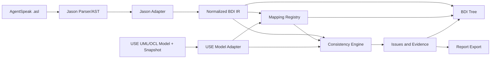

# 04. System Architecture

Status: specialized implementation notes. For the canonical current-state
architecture and limitations, see `02_SYSTEM_ARCHITECTURE.md`.

## 1. Context diagram



## 2. Layering

### Layer A — Integration shell
Menu, plugin lifecycle, project context, background task và notifications.

### Layer B — Import/adapter
Gọi Jason parser, bắt exception, chuyển Jason AST sang normalized IR.

### Layer C — Domain
IR, BDI metamodel, mapping model, issue model. Không phụ thuộc Swing hoặc Jason parser implementation.

### Layer D — Analysis
Index, symbol resolution, mapping suggestion, consistency rule engine, OCL bridge.

### Layer E — Presentation
Tree view, mapping editor, Problems table, detail/evidence panel, export.

## 3. Dependency rule

```text
UI -> Application Services -> Domain Interfaces
Jason Adapter -> Domain IR
USE Adapter -> Domain View Models
Rules -> Domain IR + Mapping + USE abstraction
Domain <- không phụ thuộc UI/Jason/USE concrete classes
```

## 4. Runtime pipeline

1. Người dùng mở `.use` trong USE.
2. Plugin tạo `UseProjectContext` từ model và system state hiện tại.
3. Người dùng import `.asl`.
4. `JasonAslParserAdapter` parse từng file.
5. `JasonAstToIrNormalizer` tạo `AgentModel`, child IR nodes và `SourceSpan`.
6. `BdiIndexBuilder` tạo index goal/plan/action/reference.
7. `MappingSuggestionService` tạo candidate mapping.
8. Người dùng xác nhận hoặc chỉnh mapping.
9. `ValidationOrchestrator` chạy rule sets.
10. `IssueStore` cập nhật Problems view và exporter.

### Phase 2 explorer slice implemented

- `BdiIndexBuilder` consumes only `model/ir` and returns an immutable
  `BdiIndex`; no Jason or USE concrete type crosses into the index package.
- `BdiImportService` imports each selected source independently, materializes
  the normalized tree, and builds the index from successful models while
  retaining diagnostics for failed files.
- `BdiImportWorker` executes that service via `SwingWorker`. The first
  `BdiExplorerView` displays source files, beliefs, goals, plans, ordered
  steps, and a detail pane with source spans/excerpts.

### Phase 2 mapping slice implemented

- `MappingSuggestionService` consumes the normalized BDI index and immutable
  USE projection to create explainable candidates for agent/class/object,
  action/operation, parameter, receiver, and belief/attribute links.
- `MappingDocument` and `MappingBinding` remain domain-only immutable values;
  `MappingEditorPanel` is the Swing confirmation boundary and is exposed as a
  `Mapping` tab in the explorer.
- `MappingFileRepository` persists confirmed bindings as versioned
  `.bdimap.json`.

### Phase 3 static consistency slice implemented

- `MappingSourceId` centralizes stable BDI source identities used by both
  suggestions and rule evaluation. `MappingStalenessDetector` reports missing
  mapping sources/targets and model fingerprint changes without mutating USE.
- `ValidationOrchestrator` executes `ConsistencyRule` implementations in stable
  parse, IR, reference, mapping, and signature phases. It consumes only the
  normalized BDI snapshot, confirmed mapping document, and immutable USE model
  projection.
- The existing Problems tab projects immutable `ConsistencyIssue` records.
  Applying a user-confirmed mapping refreshes the results immediately; it does
  not execute OCL or modify USE state.
- `RuleConfiguration` and `RuleConfigurationRepository` provide a versioned,
  dependency-free `rules.json` boundary. `ValidationOrchestrator` validates
  configured IDs and evaluates only enabled rules; the default constructor
  retains all standard rules.
- `Suppression`, `SuppressionRepository`, and `SuppressionService` provide a
  source-span fingerprint boundary. Matching open issues become
  `SUPPRESSED` with reason evidence, while the immutable BDI/USE inputs remain
  unchanged.

### Project configuration composition implemented

- `ImportBdiAction` reads the verified `MModel.filename()` value and delegates
  project-file discovery to `BdiProjectConfigurationLoader`; the parent of the
  active `.use` file is the only project-root convention.
- `BdiProjectConfiguration` composes the selected `RuleConfiguration` and
  suppressions into the Explorer's `ValidationOrchestrator`. Missing files use
  visible defaults; invalid JSON/version/rule IDs abort view creation with a
  user-facing error.
- The loader and Explorer tests cover project/default sources and actual rule
  filtering. This changes no USE core model or snapshot state.

## 5. OCL integration levels

### Level 0 — Model presence
Kiểm tra class/object/attribute/operation tồn tại.

### Level 1 — Signature
Kiểm tra owner, arity, direction và type compatibility.

### Level 2 — Snapshot precondition
Bind receiver + argument vào snapshot hiện tại và đánh giá operation precondition bằng USE.

### Level 3 — Bounded effect simulation
Chỉ chạy khi action có effect specification hoặc adapter sang SOIL/USE commands. Thực hiện trên snapshot sao chép/transaction, sau đó kiểm tra invariant và postcondition.

### Level 4 — Full behavioral verification
Không thuộc phạm vi chính.

## 6. Deployment options

### Option A — In-repository Maven module (khuyến nghị khi phát triển)

```text
use/
  use-core/
  use-gui/
  use-assembly/
  use-bdi-plugin/
```

Ưu điểm: debug trực tiếp, dùng source của USE. Nhược điểm: phải giữ fork đồng bộ upstream.

### Option B — Sibling plugin repository

```text
workspace/
  use/
  use-bdi-plugin/
```

Ưu điểm: tách biệt và dễ đóng gói. Nhược điểm: cần cấu hình dependency/source attachment.

Bắt đầu với Option A để giảm chi phí debug; tách repository sau MVP nếu cần.

## 7. Materialization strategy

Có hai cách biểu diễn BDI trong USE:

1. **Overlay mode — bắt buộc:** IR nằm trong plugin, hiển thị bằng BDI view và liên kết đến UML elements.
2. **Materialized mode — nghiên cứu/mở rộng:** sinh `.use`/`.cmd` hoặc integrated model để các BDI entities xuất hiện như object trong USE.

Overlay mode phải hoàn thành trước. Materialized mode không được chặn tiến độ mapping và validation.
