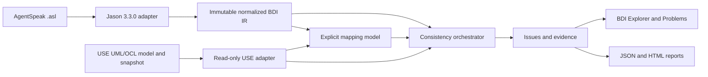

# System Architecture

Status: canonical architecture and safety boundary
Verification: source-backed; see Git history and DocumentationContractTest

## 1. Research Architecture



The plugin is a bridge between two authorities. Jason owns AgentSpeak syntax;
USE owns UML/OCL and snapshot semantics. Plugin-owned values connect them.

## 2. Layers And Dependency Rules

| Layer | Packages/components | May depend on |
| --- | --- | --- |
| Integration/UI | plugin actions, `ui` | application services and USE GUI boundary |
| Application | `application`, report composition | importer, index, mapping, validation abstractions |
| Adapters | `importer`, `use` | Jason or USE concrete APIs, respectively |
| Domain | `model.ir`, `model.mapping`, issue values | Java/plugin-owned values only |
| Analysis | `index`, `validation` | normalized IR, mappings, immutable USE projection |
| Persistence | `persistence`, report exporters | versioned plugin-owned DTOs |

Hard rules:

- Jason AST and exceptions stop in the importer/normalizer boundary.
- Swing and USE concrete classes never enter normalized IR.
- Rule evaluation consumes normalized IR and immutable projections, not parser
  AST or mutable GUI state.
- Unsupported syntax creates explicit diagnostics/features; it is never
  silently discarded.
- USE core changes require a dedicated ADR. Plugin-first is the default.

## 3. Runtime Flow

1. The user opens a `.use` model in USE.
2. `ImportBdiAction` reads the current `Session`/`MSystem`.
3. `BdiProjectConfigurationLoader` discovers optional rule and suppression
   files beside the active model.
4. A background worker parses all selected `.asl` files independently.
5. The Jason adapter normalizes successful ASTs and retains failures as
   diagnostics.
6. `BdiIndexBuilder` derives signatures, references, support, and call sites.
7. `UseUmlModelFacade` creates a deterministic read-only UML/snapshot view.
8. Suggestions remain candidates until the user confirms mapping bindings.
9. `ValidationOrchestrator` runs enabled rules by phase and applies exact
   suppressions.
10. Explorer/Problems and exporters present the same evidence model.

Asynchronous imports carry a generation token so an older completion cannot
replace a newer selection.

## 4. State Ownership And Safety

| State | Owner | Policy |
| --- | --- | --- |
| Jason AST | importer invocation | transient, never exposed |
| BDI IR/index | import snapshot | immutable |
| USE projection | adapter snapshot | immutable/read-only |
| Mappings/config/suppressions | plugin/user files | versioned and validated |
| Problems | validation run | recomputed |
| Reports | export caller | serialized supplied evidence only |

OCL results are `PASS`, `FAIL`, or `UNKNOWN`; compile/evaluation errors cannot
be converted to success. Bounded `soil:` effects execute only inside a USE
variation, and cleanup occurs in `finally`. Tests compare fingerprints before
and after analysis.

## 5. Persistence And Project Context

There is no database, server, tenant, account, or network API. Optional files:

```text
<model-directory>/
  Model.use
  .bdimap.json
  .bdi-plugin/
    rules.json
    suppressions.json
```

The active `.use` parent is the project root. Missing config files use visible
defaults; malformed versions or unknown rule IDs abort Explorer creation with
an error. `ProjectSourceId` v2 provides a case-preserving relative path and
  source range under an explicit root and rejects outside-root sources. Schema
  v2 repositories migrate v1 mappings on save and retain v1 suppression hashes
  as explicitly legacy-only entries.

## 6. Packaging And Host Lifecycle

`use-bdi-plugin` is an in-repository Maven module. USE dependencies are
`provided`; Jason 3.3.0 and required runtime dependencies are shaded without
package relocation. The assembly places the plugin JAR under `lib/plugins`.

Actions implement `IPluginActionDelegate`, access the current session through
`IPluginAction`, and add `ViewFrame` through `MainWindow.addNewViewFrame(...)`.
Replacing the JAR requires restarting USE.

## 7. Current JaCaMo Boundary

The project uses only Jason's parser/interpreter artifact as a syntax boundary.
It does not import a JaCaMo `.jcm` project, model CArtAgO artifacts/workspaces,
model Moise organizations, start a JaCaMo runtime, or consume execution traces.
Future JaCaMo work must be adapter-first and must preserve the existing IR/rule
boundaries. See [the development ideas](../idea/idea.md).

## 8. Known Architecture Gaps

- Live export of the current GUI analysis.
- Strict unknown-field policy for mapping JSON.
- Refresh/subscription when the active USE state changes after opening a view.
- Full JaCaMo project/environment/organization/runtime integration.
