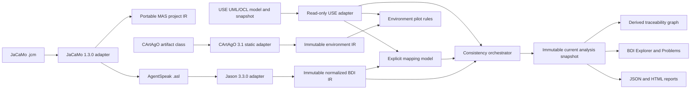

# System Architecture

Status: canonical architecture and safety boundary
Verification: source-backed; see Git history and DocumentationContractTest

## 1. Research Architecture



The plugin is a bridge between two authorities. Jason owns AgentSpeak syntax;
USE owns UML/OCL and snapshot semantics. Plugin-owned values connect them.

## 2. Layers And Dependency Rules

| Layer | Packages/components | May depend on |
| --- | --- | --- |
| Integration/UI | plugin actions, `ui` | application services and USE GUI boundary |
| Application | `application`, report composition | importer, index, mapping, validation abstractions |
| Adapters | `importer`, `use` | Jason/JaCaMo/CArtAgO or USE concrete APIs, respectively |
| Domain | `model.ir`, `model.mas`, `model.mapping`, issue values | Java/plugin-owned values only |
| Analysis | `index`, `validation` | normalized IR, mappings, immutable USE projection |
| Persistence | `persistence`, report exporters | versioned plugin-owned DTOs |

Hard rules:

- Jason AST and exceptions stop in the importer/normalizer boundary.
- JaCaMo project/parser types stop in `JaCaMoProjectParserAdapter`.
- CArtAgO artifact/annotation types stop in `CArtAgOArtifactAdapter`.
- Swing and USE concrete classes never enter normalized IR.
- Rule evaluation consumes normalized IR and immutable projections, not parser
  AST or mutable GUI state.
- Unsupported syntax creates explicit diagnostics/features; it is never
  silently discarded.
- USE core changes require a dedicated ADR. Plugin-first is the default.

## 3. Runtime Flow

1. The user opens a `.use` model in USE.
2. `ImportBdiAction` reads the current `Session`/`MSystem`.
3. `BdiProjectConfigurationLoader` discovers optional rule and suppression
   files beside the active model.
4. A background worker parses all selected `.asl` files independently.
5. The Jason adapter normalizes successful ASTs and retains failures as
   diagnostics.
6. `BdiIndexBuilder` derives signatures, references, support, and call sites.
7. `UseUmlModelFacade` creates a deterministic read-only UML/snapshot view.
8. Suggestions remain candidates until the user confirms mapping bindings.
9. `ValidationOrchestrator` runs enabled rules by phase and applies exact
   suppressions.
10. `CurrentAnalysisSnapshotService` validates once and freezes import, USE,
    mapping, config, suppressions, issues, hashes, counts, time, and versions.
11. Explorer/Problems consumes that snapshot; `CurrentAnalysisReportService`
    serializes the same object atomically as JSON or HTML without querying
    Swing, rerunning validation, or reading live USE state.
12. `HeadlessAnalysisService` compiles an isolated USE system from explicit
    files and composes the same snapshot/report services without Swing or a
    live USE session. It verifies its private state fingerprint before/after.
13. `ImportJaCaMoAction` and the Explorer `.jcm` button create the same
    immutable project request. `BdiProjectImportWorker` runs composition off
    the EDT and publishes only the current generation on the EDT.
14. `BdiQualityGateMain --jcm` validates the explicit project input, delegates
    to `MasProjectAnalysisService`, writes the existing JSON/HTML serializers,
    and prints sorted project diagnostics with the documented exit code.

Asynchronous imports carry a generation token so an older completion cannot
replace a newer selection. Manual USE refresh resolves the current session
system again, captures and validates on the EDT, rejects stale queued requests,
and verifies the state fingerprint before and after analysis.

## 4. State Ownership And Safety

| State | Owner | Policy |
| --- | --- | --- |
| Jason AST | importer invocation | transient, never exposed |
| BDI IR/index | import snapshot | immutable |
| USE projection | adapter snapshot | immutable/read-only |
| Mappings/config/suppressions | plugin/user files | versioned and validated |
| Current analysis/Problems | application snapshot service | immutable, recomputed |
| Traceability graph | trace builder | immutable, derived per snapshot, never persisted |
| Reports | GUI or headless caller | atomic serialization of supplied evidence only |

OCL results are `PASS`, `FAIL`, or `UNKNOWN`; compile/evaluation errors cannot
be converted to success. Bounded `soil:` effects execute only inside a USE
variation, and cleanup occurs in `finally`. Tests compare fingerprints before
and after analysis.

## 5. Persistence And Project Context

There is no database, server, tenant, account, or network API. Optional files:

```text
<model-directory>/
  Model.use
  .bdimap.json
  .bdi-plugin/
    rules.json
    suppressions.json
```

The active `.use` parent is the project root. Missing config files use visible
defaults; malformed versions or unknown rule IDs abort Explorer creation with
an error. `ProjectSourceId` v2 provides a case-preserving relative path and
  source range under an explicit root and rejects outside-root sources. Schema
  v2 repositories migrate v1 mappings on save and retain v1 suppression hashes
  as explicitly legacy-only entries.

## 6. Packaging And Host Lifecycle

`use-bdi-plugin` is an in-repository Maven module. USE dependencies are
`provided`; Jason 3.3.0 and required runtime dependencies are shaded without
package relocation. The assembly places the plugin JAR under `lib/plugins`.

Actions implement `IPluginActionDelegate`, access the current session through
`IPluginAction`, and add `ViewFrame` through `MainWindow.addNewViewFrame(...)`.
Replacing the JAR requires restarting USE.

## 7. Current JaCaMo Boundary

`JaCaMoProjectParserAdapter` uses the official JaCaMo 1.3.0 parser and converts
its result immediately to plugin-owned values. `MasProjectImportService`
resolves sources under an explicit project root, delegates each unique source
to `BdiImportService`, and returns portable `MasProjectModel` plus the existing
AgentSpeak snapshot. Duplicate, missing, invalid, and outside-root sources are
diagnostic outcomes rather than silent omissions.

Workspace, organization, and institution declarations are retained as
`MasResourceReference` with `UNSUPPORTED` status and `JCM-005`; the `.jcm`
importer does not automatically resolve their implementation classes.
The T14 Moise spike confirms that the organization reference remains an
explicit fallback: JaCaMo project parameters do not parse the referenced
organization file, and no verified Moise parser/API is packaged. See ADR-0032
and the Moise spike evidence before changing this boundary.
`MasProjectAnalysisService` composes the importer result with the existing
`CurrentAnalysisSnapshotService`. It accepts immutable project/USE/mapping/
configuration inputs, runs the shared validator once, and returns one
`MasProjectAnalysisResult` containing the project IR, snapshot, and sorted
project diagnostics. Direct `.asl` analysis remains compatible because both
paths consume the same `BdiImportSnapshot` and snapshot boundary.
`ImportJaCaMoAction` registers the single-select `.jcm` chooser under
`Plugins > AgentSpeak`; `BdiExplorerView` exposes the same action as
`Import .jcm...`. Project analysis is asynchronous, project diagnostics are
shown in the Explorer tree/status, and export uses the snapshot already held
by the view. `BdiQualityGateMain --jcm` is the non-Swing equivalent and rejects
mixed `.asl`/`.jcm` inputs before writing reports.
Separately, `CArtAgOArtifactAdapter` can normalize a supplied artifact class's
official `@OPERATION` metadata and explicit property descriptors. The plugin
does not start a JaCaMo/CArtAgO runtime, model Moise semantics, dynamically
inspect CArtAgO artifacts, or consume execution traces. The GUI/headless
entry points provide static `.jcm` composition only; they do not launch a
JaCaMo runtime.

Static environment bindings are persisted separately from `.bdimap.json` in a
typed `.cartago-map.json` document. `EnvironmentMappingFileRepository` requires
an explicit project root, uses portable `ProjectSourceId` v2 provenance, emits
deterministic UTF-8 JSON, and rejects unknown fields, unsupported versions,
duplicate mapping identities, invalid roots, and malformed records. The
`EnvironmentMappingValidationService` revalidates confirmed operation/property
targets against the current plugin-owned environment and USE snapshots. Only
`CONFIRMED + CURRENT` mappings reach `EnvironmentConsistencyValidator`; a
candidate is excluded, while a stale or unknown confirmed mapping emits
`ENV-004` with source and target evidence.

## 8. Traceability Boundary

`TraceabilityGraphBuilder` consumes only `CurrentAnalysisSnapshot` plus an
explicit project root. It derives portable source/BDI, confirmed mapping, UML,
OCL, gap, and issue nodes with deterministic evidence edges. Issue detail is a
backward traversal over the immutable graph. Raw Jason plan annotations are
excluded from IDs and serialized labels because they may contain absolute
source URLs. A missing mapping is a graph gap, not an inferred UML edge.

## 9. Known Architecture Gaps

- Strict unknown-field policy for mapping JSON.
- Automatic subscription when USE state changes; manual refresh is available.
- Automatic `.jcm` environment resolution, live CArtAgO state, Moise, and
  runtime integration; Moise normalization is explicitly blocked by ADR-0032.
