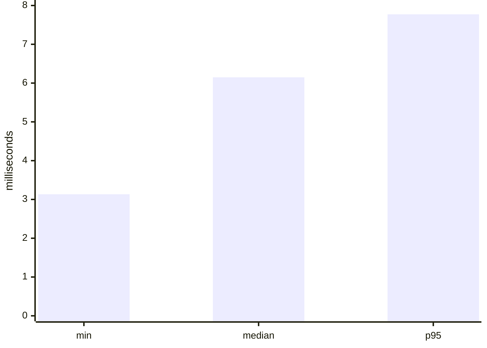

# Performance Baseline

## Workload

`BdiPerformanceBenchmarkTest` measures the actual import pipeline for
`Smart_manager_agent.asl`: Jason parsing, normalized IR materialization, and
BDI index construction. It warms up twice and measures seven iterations. Each
iteration checks the expected 9 beliefs, 1 goal, 5 plans, and non-empty indexes
before recording its duration.

## Recorded sample

The following table is the sample represented by
`use-bdi-plugin/target/performance/bdi-import-index.json` during this evidence
bundle. Values are wall-clock measurements from one Java 21 environment.

| Statistic | Time (ms) |
|---|---:|
| Minimum | 3.1334 |
| Median | 6.1485 |
| p95 | 7.7725 |



## Reproduction

```powershell
powershell -ExecutionPolicy Bypass -File .\use-bdi-plugin\scripts\performance.ps1
```

The script runs the benchmark test and prints the generated JSON. The result
is a comparison baseline, not a hard timing gate: JVM warm-up, host load, Java
version, and file-system state affect the numbers. Auction-scale performance,
memory use, and statistical confidence intervals are not claimed by this
sample.
