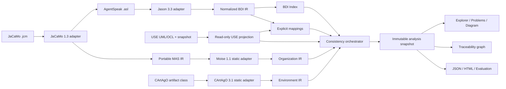

# Bài trình bày: Mở rộng USE để kiểm tra tính nhất quán giữa BDI và UML/OCL

**Đề tài:** Mở rộng USE để nhập, ánh xạ và kiểm tra tính nhất quán giữa mô hình BDI AgentSpeak và mô hình UML/OCL

**Sản phẩm:** `use-bdi-plugin` cho USE 7.1.1

**Đơn vị:** VNU SME Lab

**Giảng viên hướng dẫn:** PGS.TS. Đặng Đức Hạnh

**Repository:** [USE BDI Plugin](https://github.com/nguyentrungnghia1802/USE_BDI_Plugin)

> Tài liệu này là bài trình bày tổng quan khoảng 10-12 phút. Các tuyên bố kỹ
> thuật được giới hạn theo code, test và tài liệu chuẩn trong `docs/project`.

## 1. Mở đầu

USE là công cụ đặc tả và kiểm chứng mô hình UML/OCL. Jason và AgentSpeak được
dùng để mô tả tác tử BDI thông qua belief, goal, plan, context và action.

Hai phía đang trả lời hai nhóm câu hỏi khác nhau:

- AgentSpeak mô tả tác tử tin gì, muốn đạt gì và lựa chọn kế hoạch nào;
- UML/OCL mô tả cấu trúc miền, trạng thái đối tượng và các ràng buộc phải đúng;
- chưa có một luồng thống nhất trong USE để đối chiếu hai mô hình và giải thích
  một lỗi từ dòng AgentSpeak đến phần tử UML/OCL liên quan.

**Câu hỏi nghiên cứu chính:** Làm thế nào mở rộng USE theo hướng plugin để nhập
mô hình BDI thực, ánh xạ với UML/OCL và phát hiện các điểm không nhất quán mà
vẫn giữ được bằng chứng, mức độ chắc chắn và an toàn trạng thái?

## 2. Mục tiêu của dự án

Dự án xây dựng một cầu nối kiểm chứng, không thay thế USE hoặc Jason.

Các mục tiêu chính gồm:

- nhập trực tiếp AgentSpeak `.asl` bằng parser chính thức của Jason;
- nhập cấu trúc project JaCaMo `.jcm` ở mức tĩnh;
- chuẩn hóa dữ liệu BDI thành mô hình độc lập với parser;
- đọc mô hình và snapshot UML/OCL hiện tại của USE theo chế độ read-only;
- cho phép người dùng xác nhận ánh xạ BDI sang UML/OCL;
- chạy các luật kiểm tra cấu trúc, tham chiếu, mapping, signature và OCL;
- trả về kết quả có rule ID, source span, evidence và certainty;
- hiển thị kết quả trong USE và xuất báo cáo tái lập được.

## 3. Lõi nghiên cứu là gì?

**Lõi của dự án không phải giao diện và cũng không phải parser.** Lõi là pipeline
kiểm tra tính nhất quán dựa trên mô hình trung gian bất biến và bằng chứng có
thể truy vết.

```text
AgentSpeak / JaCaMo
        |
        v
Official parser adapters
        |
        v
Normalized immutable BDI/MAS IR
        |
        +------> BDI Index
        |
USE UML/OCL read-only projection
        |
        v
Explicit Mapping + Consistency Rules
        |
        v
Immutable Current Analysis Snapshot
        |
        +------> Problems / Diagram
        +------> Traceability
        +------> JSON / HTML / Evaluation
```

Ba ý tưởng cốt lõi:

1. **Normalized IR:** Jason AST, JaCaMo, CArtAgO, Moise và USE concrete types
   dừng tại adapter; rule engine chỉ làm việc với dữ liệu do plugin sở hữu.
2. **Evidence-preserving analysis:** mỗi finding gắn với nguồn, target UML/OCL,
   certainty và đường bằng chứng thay vì chỉ trả về một chuỗi thông báo.
3. **State safety:** USE là nguồn sự thật về UML/OCL; phân tích không được làm
   thay đổi snapshot người dùng đang làm việc.

## 4. Kiến trúc tổng thể



Kiến trúc tuân thủ nguyên tắc **plugin-first**. Dự án không sửa lexer, parser
hoặc AST lõi của USE để nhúng AgentSpeak vào ngôn ngữ USE.

## 5. Công nghệ và nền tảng sử dụng

| Thành phần | Vai trò |
| --- | --- |
| USE 7.1.1 | Host UML/OCL, object snapshot và giao diện desktop |
| Java 21, Maven | Ngôn ngữ và hệ thống build của plugin |
| Jason 3.3.0 | Nguồn sự thật cú pháp AgentSpeak `.asl` |
| JaCaMo 1.3.0 | Phân tích tĩnh project `.jcm` |
| CArtAgO 3.1 | Đọc metadata operation/property của artifact ở mức tĩnh |
| Moise 1.1 | Chuẩn hóa role, mission và cardinality tổ chức ở mức tĩnh |
| Swing và Java2D | BDI Explorer, Problems, Mapping và diagram read-only |
| JUnit 5 | Unit, integration, boundary và regression test |
| PowerShell | Package smoke, quality gate và evaluation trên Windows |
| JSON/HTML/SVG | Mapping, cấu hình, report và hình trình bày có thể tái lập |

Dự án không sử dụng database, server hoặc dịch vụ cloud. Toàn bộ workflow là
desktop và file-based.

## 6. Luồng làm việc của người dùng

1. Mở file `.use` trong USE và nạp object/link snapshot bằng `.cmd` nếu cần.
2. Mở `Plugins > AgentSpeak > Import AgentSpeak...` hoặc BDI Explorer.
3. Import trực tiếp một hay nhiều `.asl`, hoặc import một project `.jcm`.
4. Plugin parse ở background, chuẩn hóa BDI IR và xây dựng BDI Index.
5. Plugin chụp projection read-only của UML model và current USE state.
6. Người dùng kiểm tra suggestion và xác nhận mapping cần thiết.
7. Consistency orchestrator chạy các phase rule được bật.
8. Problems hiển thị finding; Diagram hiển thị BDI, mapping, UML/OCL và evidence.
9. Người dùng có thể refresh USE snapshot, lưu mapping, xuất JSON/HTML hoặc SVG.

## 7. Các chức năng đã triển khai

### 7.1. Import và mô hình trung gian

- import nhiều `.asl` với partial success theo từng file;
- giữ parser diagnostic, file, line, column và parser version;
- biểu diễn belief, goal, plan, trigger, context, step, term và source span;
- không silently ignore cú pháp chưa hỗ trợ;
- xây dựng index cho goal support, action call, reference và signature.

### 7.2. USE adapter và mapping

- đọc class, attribute, operation, association, object và link hiện tại;
- projection là immutable và read-only;
- hỗ trợ mapping Agent-Class/Object, Belief-Attribute và Action-Operation;
- suggestion chỉ là ứng viên; chỉ thao tác xác nhận mới tạo binding;
- mapping được lưu bằng JSON có version và source identity tương đối.

### 7.3. Consistency engine

Catalog chuẩn hiện có 22 rule ID, thuộc các nhóm:

- parse và unsupported syntax;
- tính đúng đắn của BDI IR;
- reference và message receiver;
- mapping và stale target;
- arity, type và operation owner;
- OCL precondition và plan context;
- bounded effect/invariant simulation.

Ngoài catalog chuẩn còn có các pilot rule riêng:

- `ENV-001..004` cho CArtAgO environment ở mức tĩnh;
- `ORG-001..003` cho Moise organization và UML/OCL ở mức tĩnh.

### 7.4. Mô hình kết quả

Mỗi issue có các thông tin quan trọng:

```text
ruleId + severity + status + certainty
sourceSpan + UML reference + evidence + suggested fix
```

OCL và bằng chứng động luôn phân biệt:

- `PASS`: có đủ bằng chứng và phép kiểm tra đúng;
- `FAIL`: có đủ bằng chứng và phép kiểm tra sai;
- `UNKNOWN`: thiếu binding, snapshot, runtime value hoặc gặp ngữ nghĩa chưa hỗ trợ.

`UNKNOWN` không bao giờ được đổi thành `PASS` để làm kết quả đẹp hơn.

### 7.5. Giao diện và trực quan hóa

BDI Explorer có bốn tab chính:

- **Explorer:** cây Agent, Belief, Goal, Plan, Context và Step;
- **Diagram:** graph BDI/MAS, mapping, UML/OCL và evidence;
- **Problems:** danh sách finding có filter và severity;
- **Mapping:** suggestion, binding, save/load và revalidation.

Diagram hỗ trợ `All`, `BDI Plan`, `Agent Overview`, `Mapping`, layer toggle,
Focus Agent, Focus Goal/Plan, Fit, Reset, Zoom và Export SVG.

## 8. Phạm vi JaCaMo hiện tại

Dự án **chưa phải tích hợp JaCaMo đầy đủ**.

Đã có:

- parse `.jcm` bằng JaCaMo 1.3.0;
- resolve agent instance và source `.asl`;
- chuẩn hóa một bounded subset của Moise organization;
- đọc metadata CArtAgO được cung cấp ở mức tĩnh;
- kiểm tra một số quan hệ organization/environment với UML/OCL;
- hiển thị MAS overview và static-only evidence trong Diagram.

Chưa có:

- khởi chạy hoặc điều khiển JaCaMo runtime từ USE;
- live CArtAgO workspace/artifact state;
- Moise enactment, monitoring hoặc dynamic membership;
- execution trace và đồng bộ state thời gian thực;
- kết luận behavioral conformance của MAS đang chạy.

Ranh giới này là chủ ý nghiên cứu: hệ thống chỉ tuyên bố điều mà static evidence
chứng minh được; phần thiếu runtime được đánh dấu `UNKNOWN`.

## 9. Case study và bằng chứng

### Auction là case study MVP

Auction được dùng để đánh giá end-to-end vì có nhiều agent, goal/plan, action,
message, UML operation, OCL precondition, organization và environment.

Bộ evaluation đã khai báo năm trường hợp:

- một baseline sạch;
- bốn mutant có lỗi đã biết;
- oracle và evidence token được review;
- runner chạy headless trong workspace cô lập;
- kết quả JSON, CSV và HTML có tính xác định theo fixture.

Kết quả này chỉ là bằng chứng trong phạm vi corpus Auction, không phải chứng
minh tính đúng tổng quát cho mọi hệ thống AgentSpeak/UML.

### Các demo phục vụ trình bày

- **Family Person:** goal-plan-action-operation đơn giản;
- **Smart Queue:** decision context và mapping operation;
- **Smart Home:** BDI kết hợp static environment;
- **Auction:** BDI, MAS, organization, environment, mapping, OCL và issue path.

## 10. Đóng góp chính của dự án

1. Một kiến trúc plugin-first kết nối hai authority: Jason cho AgentSpeak và
   USE cho UML/OCL.
2. Normalized immutable BDI IR giúp rule engine độc lập với Jason AST.
3. Mapping tường minh, có xác nhận và có thể lưu lại.
4. Consistency engine nhiều phase với evidence và certainty rõ ràng.
5. Kiểm tra snapshot OCL và bounded effect có bảo vệ state fingerprint.
6. Traceability từ source BDI qua mapping tới UML/OCL và issue.
7. Workflow GUI, headless quality gate và evaluation có thể tái lập.
8. Mở rộng tĩnh sang JaCaMo, CArtAgO và Moise mà không tuyên bố quá mức runtime.

## 11. Giới hạn và rủi ro còn lại

- coverage của AgentSpeak là subset phục vụ rule/case study, không phải toàn bộ
  ngữ nghĩa Jason;
- mapping suggestion không phải mapping tự động có tính quyết định;
- manual refresh vẫn cần thiết khi USE state thay đổi;
- organization mapping chưa có persistence hoàn chỉnh;
- chưa có live JaCaMo/CArtAgO/Moise runtime hoặc execution trace;
- chưa chứng minh semantic equivalence giữa BDI và UML/OCL;
- evaluation hiện giới hạn ở năm case Auction đã khai báo;
- cần bổ sung screenshot chuẩn và diagram performance evidence cho release.

## 12. Hướng phát triển tiếp theo

Ưu tiên gần:

1. Ổn định UI/UX và hoàn thiện bộ ảnh, flow demo có thể lặp lại.
2. Bổ sung diagram performance evidence và kiểm thử ở graph lớn.
3. Hoàn thiện persistence cho organization mapping và cross-tab navigation.
4. Mở rộng fixture/corpus để tăng độ tin cậy ngoài Auction.

Hướng nghiên cứu dài hạn:

1. Adapter runtime riêng cho JaCaMo thay vì đưa runtime types vào rule engine.
2. Thu thập execution trace và ánh xạ event sang snapshot USE theo thời gian.
3. Theo dõi live CArtAgO property và Moise enactment với semantics rõ ràng.
4. So sánh static finding với runtime evidence mà vẫn giữ `UNKNOWN` khi thiếu dữ liệu.
5. House Building có thể là corpus thứ hai nhưng không làm chậm Auction MVP.

## 13. Flow trình bày và demo đề xuất

### Phần nói, khoảng 7 phút

1. Nêu khoảng trống giữa AgentSpeak BDI và UML/OCL.
2. Trình bày câu hỏi nghiên cứu và nguyên tắc plugin-first.
3. Nhấn mạnh lõi: normalized IR, mapping, consistency engine và evidence.
4. Đi qua sơ đồ kiến trúc và các technology adapter.
5. Nêu ranh giới: static JaCaMo, chưa có runtime.
6. Trình bày Auction evaluation và giới hạn claim.

### Phần demo, khoảng 4 phút

1. Mở một `.use` và chạy `.cmd` để tạo snapshot.
2. Mở BDI Explorer và import `.asl` hoặc `.jcm`.
3. Trong Explorer, chọn một plan để chỉ source span và cấu trúc IR.
4. Trong Mapping, chỉ một confirmed binding và một suggestion chưa xác nhận.
5. Trong Problems, chọn một issue để mở evidence path trên Diagram.
6. Chuyển Diagram sang `BDI Plan`, bấm `Fit`, rồi `Focus Goal/Plan`.
7. Giải thích `PASS/FAIL/UNKNOWN` và static-only legend.
8. Xuất SVG hoặc current analysis report để chứng minh tính tái lập.

## 14. Kết luận

USE BDI Plugin hướng tới một môi trường kiểm chứng tích hợp, trong đó hành vi
BDI không bị tách rời khỏi cấu trúc và ràng buộc UML/OCL.

Giá trị chính của dự án không nằm ở việc hiển thị thêm một cây AgentSpeak, mà
ở khả năng tạo ra **kết quả kiểm tra có nguồn gốc, có mapping, có bằng chứng,
có mức độ chắc chắn và có thể tái lập**.

Thông điệp kết thúc:

> Jason xác định AgentSpeak có nghĩa gì về mặt cú pháp, USE xác định UML/OCL và
> snapshot có nghĩa gì, còn plugin cung cấp lớp IR, mapping và consistency
> evidence để hai phía có thể được kiểm tra cùng nhau một cách có kiểm soát.

## Tài liệu nguồn

- `docs/project/00_PROJECT_CONTEXT.md`
- `docs/project/04_SYSTEM_ARCHITECTURE.md`
- `docs/project/08_CONSISTENCY_RULE_CATALOG.md`
- `docs/project/10_PLUGIN_TECHNICAL_DESIGN.md`
- `docs/project/16_PROJECT_COMPLETION_CHECKLIST.md`
- `docs/guide/guide.md`
