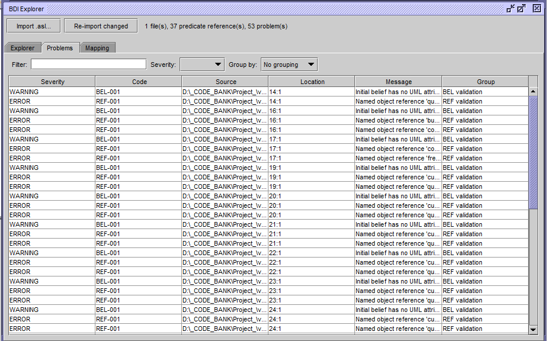
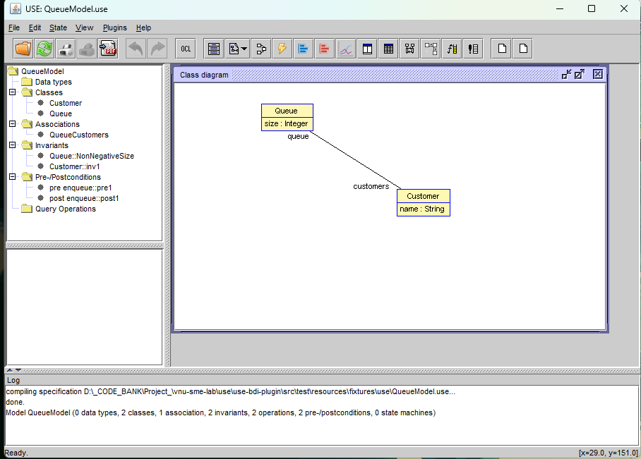

# Báo Cáo Phát Triển và Tích Hợp USE BDI Plugin

**Dự án:** USE BDI Plugin  
**Cơ quan/Trường:** VNU SME Lab  
**Giáo viên hướng dẫn:** Thầy Đặng Đức Hạnh  

---

## 1. Giới Thiệu Chung
**USE BDI Plugin** là một phần mở rộng được phát triển cho hệ thống **USE (UML-based Specification Environment)**. Mục tiêu cốt lõi của plugin là thu hẹp khoảng cách giữa mô hình tác tử (BDI - Belief-Desire-Intention) và mô hình hướng đối tượng (UML). 

Plugin cho phép người dùng nạp mã nguồn tác tử (viết bằng ngôn ngữ AgentSpeak, file `.asl`), phân tích cú pháp (parse), và tự động kiểm tra tính nhất quán (Consistency Checking) giữa hành vi logic của tác tử và trạng thái mô phỏng (State) của hệ thống UML.

## 2. Công Nghệ và Kiến Trúc Tích Hợp
- **Ngôn ngữ phát triển:** Java 17+ (để đồng bộ với hệ sinh thái USE hiện tại).
- **Công nghệ nền tảng:**
  - **USE Plugin API**: Khai thác cơ chế mở rộng của USE (thông qua `PluginActionProxy`, `PluginActionDelegate`) để nhúng giao diện **BDI Explorer** trực tiếp vào USE GUI.
  - **Jason / AgentSpeak Parser**: Sử dụng bộ phân tích cú pháp để đọc hiểu và số hóa file `.asl`.
  - **OCL (Object Constraint Language)**: Đánh giá các điều kiện (Context) của tác tử dựa trên trạng thái UML thông qua `UseOclEvaluator`.

### Luồng hoạt động (Workflow) của Hệ thống
1. **Import ASL:** Người dùng click nút **"Import .asl..."** trên giao diện BDI Explorer. Lớp `BdiImportWorker` chạy ngầm để đọc file mã nguồn tác tử.
2. **Xây dựng IR (Intermediate Representation):** File `.asl` được chuyển đổi thành cấu trúc dữ liệu trung gian (IR) độc lập và được lập chỉ mục bởi `BdiIndexBuilder`.
3. **Phân tích UML Snapshot:** Lớp `UseUmlModelFacade` trích xuất trạng thái hiện tại của USE (gồm Classes, Attributes, Objects, Links) thành một `UseModelSnapshot`.
4. **Kiểm tra tính nhất quán (Consistency Engine):** `ValidationOrchestrator` sử dụng tập luật `StandardConsistencyRules` để đối chiếu IR của tác tử với UML Snapshot, từ đó phát hiện các sai lệch.
5. **Hiển thị (UI):** Kết quả phân tích được trình bày trực quan trên **BDI Explorer** (dạng Tree View) và tab **Problems** (danh sách lỗi/cảnh báo).

## 3. Demo và Tính Năng Hoạt Động
Plugin hiện tại đã tích hợp thành công mô hình **Smart Queue Case Study** (được mở rộng đầy đủ các lớp UML: `Manager`, `Counter`, `Staff`, `Queue`, `Customer`).

### 3.1. Phân tích mã nguồn ASL thành công
Giao diện BDI Explorer hiển thị chính xác cấu trúc của Agent dưới dạng cây:



*Hình 1: Giao diện BDI Explorer với nút **"Import .asl..."** (góc trên trái). Hệ thống đã phân tích thành công 9 Beliefs, 1 Goal và 5 Plans từ file `Smart_manager_agent.asl`.*

### 3.2. Đánh giá tab "Problems" (Tính năng Consistency Engine)
Những thông báo hiện tại trong tab **Problems** hoàn toàn **không phải là lỗi (bug) của mã nguồn Plugin**. Đây là tính năng cốt lõi của công cụ nhằm chỉ ra sự thiếu đồng bộ giữa mã Agent và State của mô hình UML:


*Hình 2: Các thông báo từ Consistency Engine nhắc nhở người dùng hoàn thiện State và Mapping.*

- **REF-001 (Named object reference absent):** Engine báo lỗi do State (trạng thái hệ thống) của USE đang rỗng, chưa tạo các Object (như `queue1`, `counter1`). Người dùng chỉ cần vào `State -> Create object` để giải quyết.
- **BEL-001, MAP-001:** Cảnh báo người dùng chưa xác nhận ánh xạ (Mapping) giữa các Beliefs của Agent và Attributes của UML trong tab Mapping.

## 4. Trích Xuất Code Cốt Lõi (Core Logic)
Dưới đây là một số đoạn mã tiêu biểu minh họa cách Engine hoạt động.

**Đăng ký các bộ luật kiểm tra (trong `StandardConsistencyRules.java`):**
```java
static List<ConsistencyRule> create() {
    return List.of(
        rule("ASL-001", RulePhase.PARSE, StandardConsistencyRules::parseErrors),
        rule("BDI-001", RulePhase.IR_WELL_FORMEDNESS, StandardConsistencyRules::duplicatePlanLabels),
        rule("REF-001", RulePhase.REFERENCE, StandardConsistencyRules::unresolvedReferences),
        rule("MAP-001", RulePhase.MAPPING, StandardConsistencyRules::unmappedAgents),
        rule("BEL-001", RulePhase.MAPPING, StandardConsistencyRules::unmappedBeliefs),
        rule("MSG-001", RulePhase.REFERENCE, StandardConsistencyRules::unknownMessageReceivers)
        // ...
    );
}
```

**Thuật toán phát hiện thiếu Object (Luật REF-001):**
```java
private static List<ConsistencyIssue> unresolvedReferences(ValidationContext context) {
    // 1. Lấy danh sách toàn bộ các đối tượng đang có trong phiên làm việc của USE
    Set<String> objectNames = context.uml().orElseThrow().objects().stream()
            .map(UmlObjectRef::reference)
            .collect(Collectors.toSet());
            
    // 2. Lọc các tham chiếu trong file .asl mà KHÔNG tồn tại trong USE State
    allReferences(context.index().objectReferencesByName().values()).stream()
            .filter(reference -> !objectNames.contains(reference.name()))
            .forEach(reference -> issues.add(issue(
                    "REF-001", 
                    IssueSeverity.ERROR,
                    "Named object reference '" + reference.name() + "' is absent from the current USE state",
                    reference.sourceSpan(),
                    // ... (đẩy lỗi ra UI)
            )));
    return List.copyOf(issues);
}
```

## 5. Các Vấn Đề Còn Tồn Đọng (Known Issues)
- **Bug nhỏ trong luật REF-001:** Hiện tại rule này đang "quét quá rộng" và bắt nhầm cả các giá trị Enum (`free`, `busy`) cũng như các biểu thức điều kiện (Context Expressions như `N > 5`) làm tham chiếu đối tượng (Object Reference). Nguyên nhân sâu xa nằm ở lớp `BdiIndexBuilder` khi nó đẩy toàn bộ *arguments* của một *literal* vào chung một danh sách Object Reference mà chưa phân loại kỹ.

## 6. Kế Hoạch Tuần Tới
1. **Sửa Bug REF-001:** Cập nhật bộ chỉ mục `BdiIndexBuilder` để hệ thống có khả năng phân biệt và lọc bỏ các giá trị Enum, Context Expressions ra khỏi danh sách kiểm tra Object Reference.
2. **Nghiên cứu Visualization (Sơ đồ BDI):** Tìm hiểu khả năng vẽ sơ đồ đồ họa (Diagram) trực quan cho mô hình BDI Agent bên trong USE GUI, hỗ trợ cho giao diện Tree View hiện tại.
3. **Hoàn thiện Auto-Mapping:** Bổ sung tính năng tự động gợi ý ánh xạ (Auto-mapping) giữa Belief của Agent và Attribute của UML dựa trên sự tương đồng về tên.

---
*Báo cáo được thực hiện nhằm tổng kết giai đoạn tích hợp kỹ thuật của Plugin BDI, xác minh tính đúng đắn của Consistency Engine và định hướng lộ trình phát triển tiếp theo.*
